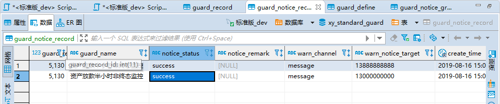

## 通用告警系统配置方法

### 说明

通用告警系统是指使用者通过简单配置即可完成相应业务监控并告警。

- 热加载：新增业务监控不用重启应用
- 线程隔离：每个告警任务不同线程，互不影响
- 告警类型：SQL配置、HTTP拨测....可扩展
- 告警检查频率：Cron表达式，只支持到分 ，如每分钟扫描一次：*/1 * * * *
- 告警渠道：短信、邮件...可扩展
- 告警发送频率：默认1小时内发送一条，可配置

### 使用方式
- 增加SQL业务告警内容
 

- 增加HTTP接口拨测

- 配置告警系统的datasource，注意密码请存ThreeDESUtil加密后的密文（HTTP拨测不需要）

- 配置告警组

- 配置告警业务对应的告警组

### 调度记录查看
- 调度记录查看

- 短信发送记录

